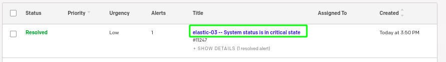

### Custom script to add Hostname on Summary field in pagerduty Webhook.

Use it with : https://www.zabbix.com/fr/integrations/pagerduty

To change summary feild on pagerduty event, you can modify :

          fields.payload = {
              summary: params.hostname + " -- " + params.eventname,
              source: (params.event_source === '1') ? 'Discovery' : params.hostname + ' : ' + params.hostip,
              severity: severityMapping[params.severity],
          };
          
          
  
